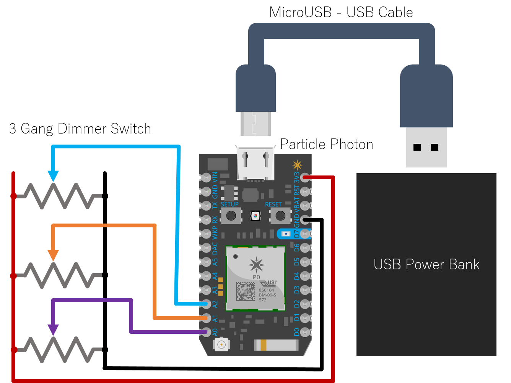

# Philips Hue with Particle Photon

This repository contains code used to make a Particle Photon control Philips Hue lights.

## How does it work?

In this example, it does this by reading the analog voltages across three potentiometers - one for hue, saturation, and brightness.
The program could easily be adapted to use any other kinds of sensors you might attach to the Photon.



The collected voltages are mapped onto the three colour values. The Photon's analog read function has 12-bit resolution.
The Hue Lights expect hue, saturation and brightness to be given as 16-, 8-, and 8-bit unsigned integers respectively, so some bit-shifts are used.

The collected values are bundled together into a JSON formatted string. Something like this:

`{"hue": 65535, "sat": 255, "bri": 255}`

This data then needs to be sent to each of the lights to be controlled using an HTTP PUT request.

For this to work, the program needs to know:
  - The internal IP address of the Hue Bridge. This can be obtained by going to [https://www.meethue.com/api/nupnp] e.g.
    - `byte ip[] = { 192, 168, 1, 23 };`
  - The developer ID to gain access to the bridge. [Follow this guide](https://www.developers.meethue.com/documentation/getting-started) to obtain a developer ID.
    - `String id = "0123456789abcdefghijklmnopqrstuvwxyzABCD";`
  - The numbers of the lights you want to control. Each light needs to be controlled individiually.
    - `int lights[] = { 1, 2, 3 };`

Assemble these component parts to form the URL to control each light individually.

`http://<ip>/api/<id>/lights/<light number>/state`

To control, for example, light number 3, the JSON data needs to be PUT to this address:

`http://192.168.1.23/api/0123456789abcdefghijklmnopqrstuvwxyzABCD/lights/3/state`

This PUT request is made using a `TCPClient` by connecting to the IP address on any port, printing an HTTP header, then a blank line, then the JSON string. Be careful to include the length of the JSON string in the header.

So the overall HTTP request should look something like this:

```
PUT http://192.168.1.23/api/0123456789abcdefghijklmnopqrstuvwxyzABCD/lights/3/state HTTP/1.0
Host: 198.168.1.23
User-Agent: Particle-Photon
Content-Type: application.json
Content-Length: 38

{"hue": 65535, "sat": 255, "bri": 255}
```

To show that everything is working, the onboard LED connected to pin D7 will flash twice once the initial connection is made and will flash every time a HTTP PUT request is made.
