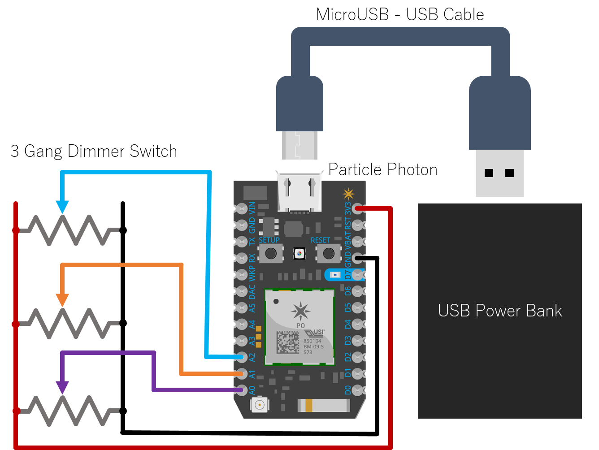
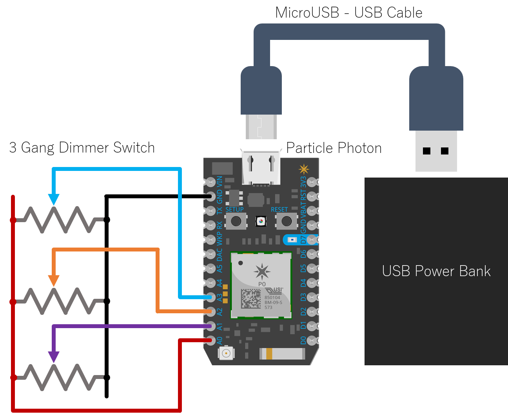

# Philips Hue with Particle Photon

This repository contains code used to make a Particle Photon control Philips Hue lights.

## How does it work?

In this example, it does this by reading the analog voltages across three potentiometers - one for hue, saturation, and brightness.
The program could easily be adapted to use any other kinds of sensors you might attach to the Photon.



The collected voltages are mapped onto the three colour values. The Photon's analog read function has 12-bit resolution.
The Hue Lights expect hue, saturation and brightness to be given as 16-, 8-, and 8-bit unsigned integers respectively, so some bit-shifts are used.

The collected values are bundled together into a JSON formatted string. Something like this:

`{"hue": 65535, "sat": 255, "bri": 255}`

This data then needs to be sent to each of the lights to be controlled using an HTTP PUT request.

For this to work, the program needs to know:
  - The internal IP address of the Hue Bridge. This can be obtained using [Hue's UPnP server](https://www.meethue.com/api/nupnp).
    - `byte ip[] = { 192, 168, 1, 23 };`
  - The developer ID to gain access to the bridge. [Follow this guide](https://www.developers.meethue.com/documentation/getting-started) to obtain a developer ID, or download [this app I made](https://chrome.google.com/webstore/detail/hue-light-controller/okogmhcbjehmmfmhmolkbpbhbnmmcgnd) and look in the settings panel.
    - `String id = "0123456789abcdefghijklmnopqrstuvwxyzABCD";`
  - The numbers of the rooms or lights you want to control. There is no need to add lights to the list that are already part of a room being controlled, as this would double up on requests. You can leave one of these lists empty if it is not required.
    - `int rooms[] = { 1 };`
    - `int lights[] = { 2, 3 };`

Set these values where you see them, near the top of file.

These component parts are assembled to form the URL to control each room or light individually:
  - For rooms:  `http://<ip>/api/<id>/groups/<room number>/action`
  - For lights: `http://<ip>/api/<id>/lights/<light number>/state`

To control, for example, light number 3, the JSON data needs to be PUT to this address:

`http://192.168.1.23/api/0123456789abcdefghijklmnopqrstuvwxyzABCD/lights/3/state`

This PUT request is made using a `TCPClient` by connecting to the IP address on any port, printing an HTTP header, then a blank line, then the JSON string. Be careful to include the length of the JSON string in the header.

So the overall HTTP request should look something like this:

```
PUT /api/0123456789abcdefghijklmnopqrstuvwxyzABCD/lights/3/state HTTP/1.0
Host: 198.168.1.23
User-Agent: Particle-Photon
Content-Type: application/json
Content-Length: 38

{"hue": 65535, "sat": 255, "bri": 255}
```

In practice, not all of this information is required for the system to work, so some lines can be omitted. The following is the bare minimum for the PUT request:

```
PUT /api/0123456789abcdefghijklmnopqrstuvwxyzABCD/lights/3/state HTTP/1.0
Content-Length: 38

{"hue": 65535, "sat": 255, "bri": 255}
```

Note that an empty line is required to separate the request header from the request body, and the Content-Length attribute is required to denote the end of the body.

To show that everything is working, the onboard LED connected to pin D7 will flash twice once the initial connection is made and will flash every time an HTTP PUT request is made. Delays are built in to reduce the amount of work for the Photon and to prevent spamming to the Hue Bridge.

#### Reversing Potentiometer Voltages

Depending on the layout of your wires to connect the potentiometers to the Particle Photon, you may find that your potentiometers rotate counter-intuitively to control the Hue lights. You could rewire it all, but there is also a quick software fix.

Use the compile directive `#define REVERSE_VOLTAGES true` near the top of the file to toggle whether high voltage corresponds to low or high Hue values.

#### Manual WiFi Control

Since the Photon can be powered over any 5V supply, it is useful to maximise its battery life by turning off the WiFi module when it is not in use. To do this, a counter is incremented every loop of the program and reset when an update is sent to the lights. If this counter exceeds some limit, the WiFi will be turned off. The LED is set to flash 3 times before disabling the WiFi module.

It takes a few seconds for the WiFi module to restart when using this mode, which may not be desirable. Therefore, this can be toggled with a compile directive near the top of the file.

`#define MANUAL_WIFI true`

Additionally, there is a separate file for this skew, `hue-photon-manual-wifi.ino`.

Note that the WiFi module must be enabled to flash firmware changes to the Photon. Therefore it is necessary to adjust the potentiometers to wake up the WiFi module just before flashing.


#### Compact Wiring Layout

It is possible to rewire the circuit above so that only the analog side of the Particle Photon board is used. In this case, power is supplied by setting one of the analog pins to output maximum voltage using `digitalWrite(A0, HIGH);`. The other analog pins are used for input, as before.



This is useful when putting all of the electronics in a compact case, as then one side of the board can be pushed up against the edge of the case.

There is a compile directive near the top of the file to toggle between this layout and the default layout.

`#define COMPACT true`

Additionally, there is a separate file for this skew, `hue-photon-compact.ino`


